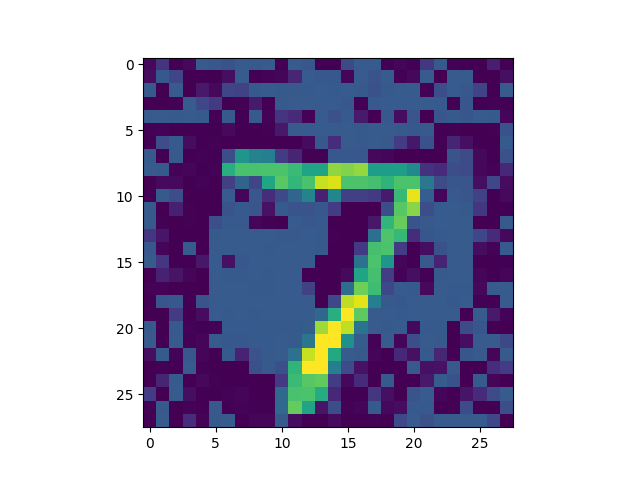

# SDP Neural Network Verification Methods
The project is for neural network verification

The following picture will be classified as "0" in the neural network

## 1. DeepSDP
Mahyar Fazlyab, Manfred Morari, George J. Pappas, "[Safety Verification and Robustness Analysis of Neural Networks via Quadratic Constraints and Semidefinite Programming](https://arxiv.org/abs/1903.01287)"
## 2. SDR
Raghunathan A, Steinhardt J, Liang P. [Semidefinite relaxations for certifying robustness to adversarial examples. arXiv preprint arXiv:1811.01057. 2018 Nov 2](https://arxiv.org/abs/1811.01057).
## 3. DeepSDP_plus
Made improvements based on DeepSDP

